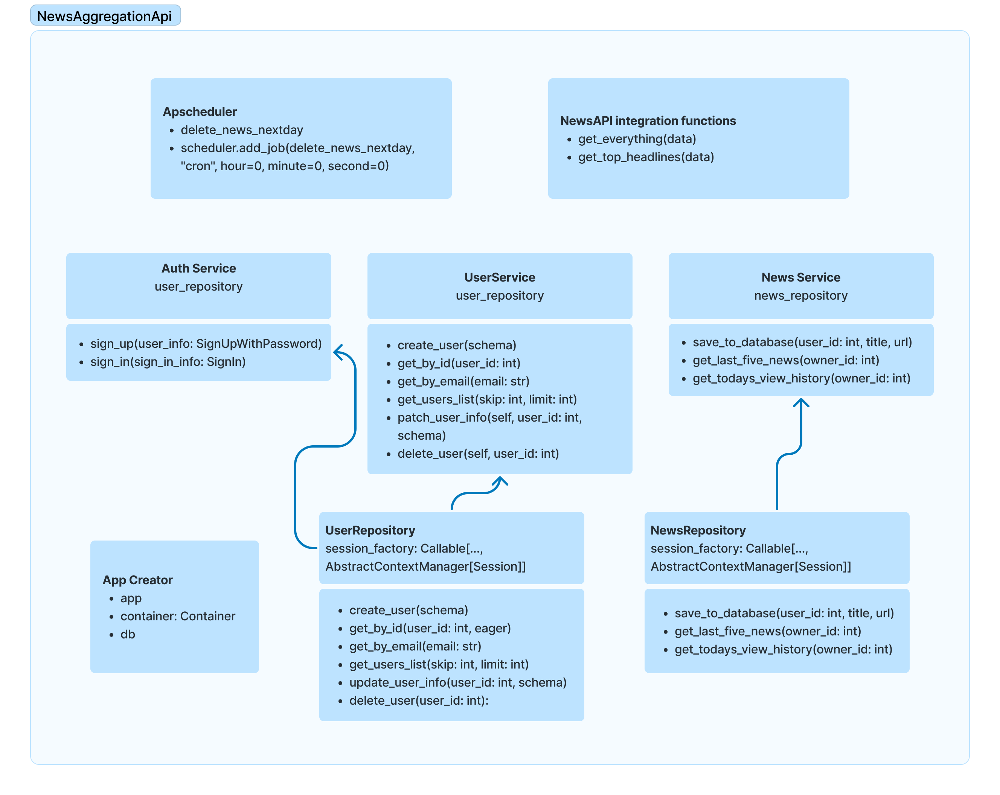

## News Aggregation API

### Main Diagram:


### Description
FastAPI project for integrating NewsAPI by applying general RestAPI Aplication cases


## Base Models
1. user
2. news

### Integrated with
1. Python3.11+
2. Fastapi 0.103.2
3. Database
   1. Postgresql
   2. Migration with alembic
4. dependency-injector
   1. service-repository pattern
5. JWT authentication
   1. role separation each endpoint


### Commands
1. Server
     1. `uvicorn app.main:app --reload`: base
     2. options
        1. host: `--host 0.0.0.0`
        2. port: `--port 8000`
2. Alembic
    1. `alembic revision -m <message>`: create a new revision of the environment
	2. `alembic upgrade <revision #>`: run our upgrade migration to our database
	3. `alembic downgrade <revision #>`: run our downgrade migration


### Sample env
```dotenv
# postgres case
ENV=dev
DB=postgresql
DB_USER=
DB_PASSWORD=
DB_HOST=localhost
DB_PORT=5432
```
SECRET_KEY = "SECRET_KEY_VALUE"

MY_NEWSAPI_KEY = "MY_NEWSAPI_KEY_VALUE"

### References
1. [FastAPI official docs](https://fastapi.tiangolo.com/)
2. [alembic official tutorial](https://alembic.sqlalchemy.org/en/latest/tutorial.html)
3. [Dependency Injector](https://python-dependency-injector.ets-labs.org/)
